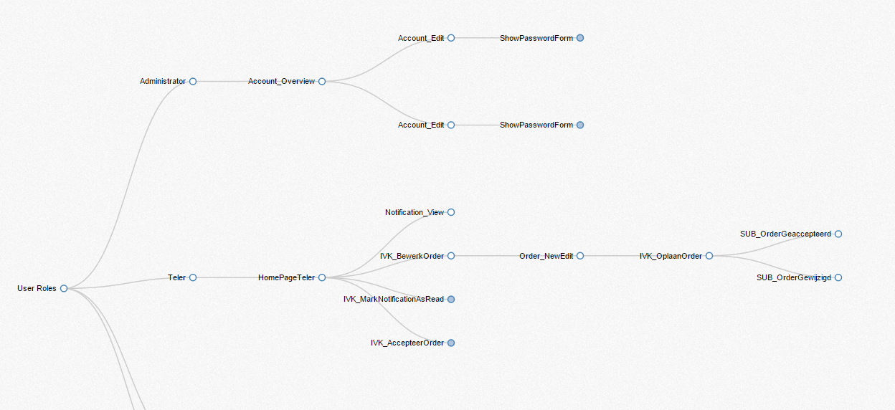

# SDK User Visualisation
## Setup
To set up and use the sdk you need to have node js installed on your machine. You will need to have also installed typescript and tsd.
The following command will install typescript and tsd globally for you:

`npm install -g typescript tsd`

Open up the folder using node.js.
To install the sdkuservisualisation you should type the command:

`npm install`

This is will install the sdk visualisation and all the relevant dependencies.

Then type:

`tsd install`

This will install all the necessary typings. This will only work if you have installed tsd before hand.

To connect it to your project you need to change the following constants in the `script.ts`

`var username = "{{Username}}";`

`var apikey = "{{ApiKey}}";`

`var projectId = "{{ProjectId}}";`

`var projectName = "{{ProjectName}}";`

API keys can be found in the mendix home portal.

## Use the visualisation
Once the visualiser is installed type:
`tsc`
to compile the visualisation code.

Then after compiled type:
`node script.js`

This will start running the script. Once the script has completed visualising your project it will load up a browser to display the visualisation.

</img>
